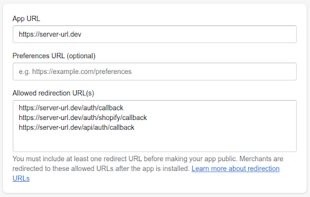

# Shopify-Userwerk-Application

## Tech Stack

This template combines a number of third party open source tools:

-   [Laravel](https://laravel.com/) builds and tests the backend.
-   [Vite](https://vitejs.dev/) builds the [React](https://reactjs.org/) frontend.
-   [React Router](https://reactrouter.com/) is used for routing. We wrap this with file-based routing.
-   [React Query](https://react-query.tanstack.com/) queries the Admin API.

These third party tools are complemented by Shopify specific tools to ease app development:

-   [Shopify API library](https://github.com/Shopify/shopify-api-php) adds OAuth to the Laravel backend. This lets users install the app and grant scope permissions.
-   [App Bridge React](https://shopify.dev/docs/tools/app-bridge/react-components) adds authentication to API requests in the frontend and renders components outside of the embedded App’s iFrame.
-   [Polaris React](https://polaris.shopify.com/) is a powerful design system and component library that helps developers build high quality, consistent experiences for Shopify merchants.
-   [Custom hooks](https://github.com/Shopify/shopify-frontend-template-react/tree/main/hooks) make authenticated requests to the GraphQL Admin API.
-   [File-based routing](https://github.com/Shopify/shopify-frontend-template-react/blob/main/Routes.jsx) makes creating new pages easier.

## Getting started

### Requirements

1. You must [create a Shopify partner account](https://partners.shopify.com/signup) if you don’t have one.
2. You must create a store for testing if you don't have one, either a [development store](https://help.shopify.com/en/partners/dashboard/development-stores#create-a-development-store) or a [Shopify Plus sandbox store](https://help.shopify.com/en/partners/dashboard/managing-stores/plus-sandbox-store).
3. You must have [PHP](https://www.php.net/) installed.
4. You must have [Composer](https://getcomposer.org/) installed.
5. You must have [Node.js](https://nodejs.org/) installed.

### Setting up your Laravel app

Once the Shopify CLI clones the repo, you will be able to run commands on your app.
However, the CLI will not manage your PHP dependencies automatically, so you will need to go through some steps to be able to run your app.
These are the typical steps needed to set up a Laravel app once it's cloned:

1. Start off by switching to the `web` folder:

    ```shell
    cd web
    ```

2. Install your composer dependencies:

    ```shell
    composer install
    ```

3. Create the `.env` file:

    ```shell
    cp .env.example .env
    ```
   Fill the .env with appropriate data from personal [login to Shopify partner account](https://partners.shopify.com/organizations). 
   You need to change only 6 values: APP_NAME, APP_URL, SHOPIFY_API_KEY, SHOPIFY_API_SECRET, HOST, SITE_URL:
   <br /><br />
   - APP_NAME = preferable name;
   - APP_URL = plugin location on the server
   - SHOPIFY_API_KEY = Partners Shopify -> Apps -> Your App -> Overview -> Client ID;
   - SHOPIFY_API_SECRET = Partners Shopify -> Apps -> Your App -> Overview -> Client Secret;
   - HOST_URL = Must be the same as APP_URL;
   - SITE_URL = postfix part to the script.js location. Generates automatically by plugin on the basis of users input.
   <br /><br />

   Example:   
   ```dotenv
   APP_URL=https://server-url.dev
   
   SHOPIFY_API_KEY=c5ebc1bccf944dbv4b17fd4cb20a5d0b
   SHOPIFY_API_SECRET=2ccc7a2cafb8d055801433474f0432a7

   HOST=https://server-url.dev
  
   SITE_URL=staging.script.com/script.js
   ```

4. Fill your `.env` file with database credentials such as:
   - DB_HOST, 
   - DB_USERNAME, 
   - DB_PASSWORD with corresponding data.
     <br /><br />
   Then go to Shopify partner account go to Apps -> All apps -> your_app -> App Setup. Then fill URLs block to grant the app urls access to Shopify store(s).
   <br /><br />
   - App URL = URL for the root where plugin stores
   - Preferences URL (optional) = live blank
   - Allowed redirection URL(s) = urls for plugin callbacks
       - ../auth/callback
       - ../auth/shopify/callback
       - ../api/auth/callback
   

   &nbsp;&nbsp;&nbsp;&nbsp;&nbsp;&nbsp;See the reference example assuming the root is `https://server-url.dev`:


   &nbsp;&nbsp;&nbsp;&nbsp;&nbsp;&nbsp;


5. Generate an `APP_KEY` for your app:

    ```shell
    php artisan key:generate
    ```

6. Copy `.env` created in previous step and place it to the plugin root. Move one level up and run docker-compose for creating database using following commands:

    ```shell
    cd ..
    docker-compose -f docker-compose-db.yml up
    ```
    **NOTE** There must be 2 `.env` files with the same data. They should be stored in ` ./ ` and ` ./web/ `.


7. Create the necessary Shopify tables in your database:

    ```shell
    php artisan migrate
    ```

8. Install npm in fronted folder:

    ```shell
    cd frontend
    npm install
    ```

9. Return to main directory (Shopify-Userwerk-Application) and install npm:

   ```shell
   npm install
   ```

### Local Development

[The Shopify CLI](https://shopify.dev/docs/apps/tools/cli) connects to an app in your Partners dashboard.
It provides environment variables, runs commands in parallel, and updates application URLs for easier development.

You can develop locally using your preferred Node.js package manager.
Run one of the following commands from the root of your app:

Using yarn:

```shell
yarn dev
```

Using npm:

```shell
npm run dev
```

Using pnpm:

```shell
pnpm run dev
```

Open the URL generated in your console. Once you grant permission to the app, you can start development.

## Deployment

### Application Storage

This template uses [Laravel's Eloquent framework](https://laravel.com/docs/9.x/eloquent) to store Shopify session data.
It provides migrations to create the necessary tables in your database, and it stores and loads session data from them.

The database that works best for you depends on the data your app needs and how it is queried.
You can run your database of choice on a server yourself or host it with a SaaS company.
Once you decide which database to use, you can update your Laravel app's `DB_*` environment variables to connect to it, and this template will start using that database for session storage.

### Build

The frontend is a single page React app. It requires the `SHOPIFY_API_KEY` environment variable, which you can find on the page for your app in your partners dashboard.
The CLI will set up the necessary environment variables for the build if you run its `build` command from your app's root:

Using yarn:

```shell
yarn build --api-key=REPLACE_ME
```

Using npm:

```shell
npm run build --api-key=REPLACE_ME
```

Using pnpm:

```shell
pnpm run build --api-key=REPLACE_ME
```

The app build command will build both the frontend and backend when running as above.
If you're manually building (for instance when deploying the `web` folder to production), you'll need to build both of them:

```shell
cd web/frontend
SHOPIFY_API_KEY=REPLACE_ME yarn build
cd ..
composer build
```

### Creating database

Make sure that database were created and its credentials where paced in ` ./.env ` and ` ./web/.env `. 

### Docker container
Run command below for creating container and running the application. After implementing the command application will be running on port `:80`:

```
docker-compose -f docker-compose-app.yml up
```
**NOTE**: Check data in 2 `.env` files, especially `SHOPIFY_API_KEY` before running command above.


## Hosting

Set the following variables:

| Variable          | Secret? | Required |     Value      | Description                                                                         |
| ----------------- | :-----: | :------: | :------------: | ----------------------------------------------------------------------------------- |
| `APP_KEY`         |   Yes   |   Yes    |     string     | Run `php web/artisan key:generate --show` to generate one.                          |
| `APP_NAME`        |         |   Yes    |     string     | App name for Laravel.                                                               |
| `APP_ENV`         |         |   Yes    | `"production"` |                                                                                     |
| `DB_CONNECTION`   |         |   Yes    |     string     | Set this to the database you want to use, e.g. `"sqlite"`.                          |
| `DB_DATABASE`     |         |   Yes    |     string     | Set this to the connection string to your database, e.g. `"/app/storage/db.sqlite"` |
| `DB_FOREIGN_KEYS` |         |          |     `true`     | If your app is using foreign keys.                                                  |
